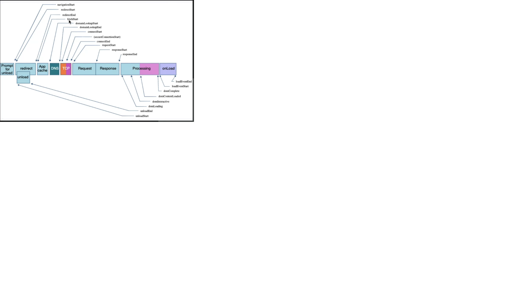
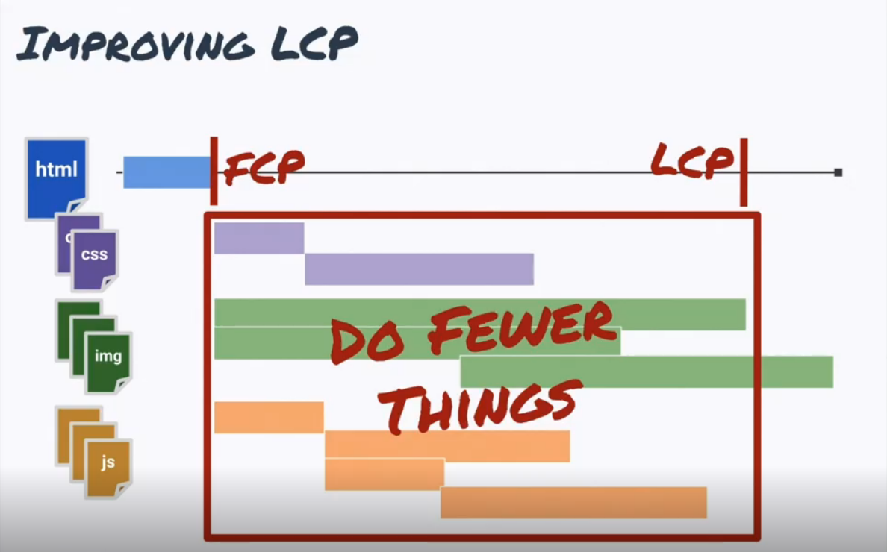

# Web Performance Fundamentals

## Elements of Performance

### Importants

- Google will rank you on your performance
- Angry and frustrated users don't stick around long
- Exercise: Performance ranking
  1. https://www.npr.org/ (ads display after)
  2. https://www.wsj.com/
  3. https://www.nytimes.com/
  4. https://www.cnn.com/ (ads display first)

### Psychology of Waiting

- People want to start
- Bored waits feel slower
- Anxious waits feel slower
- Unexplained waits feel slower
- Uncertain waits feel slower
- People will wait for value

### Web Vitals

- FCP (First contentful paint) => Respond quick
  - The time until the user sees an indication that the page is loading
- LCP (Largest contentful paint) => Get to the point
  - The time until the largest percent of content painted on the screen (images etc...)
  - Google time: 2.5sec - Good, 4.0sec - needs improvement
- CLS (Comulative layout shift) => Don't move stuff
  - The movement distance and impact of page elements during the entire lifetime of the document the user sees
  - Google time: 0.1 - Good, 0.25 - needs improvement
- FID (First input delay) => Don't load too much
  - Browser background and async work
  - The browser time delay between the user's first click and execution of application code
  - Google time: 100ms - Good, 300ms - needs improvement

### Lighthouse

- Relative to your machine, network
- Chrome window size
- Chrome application priority
- Keep Chrome foreground when running Lighthouse (if not, the result will be weird), detach detact window, disable extentions

## Metrics (Số liệu)

### Where to measure performance

1. Lab data: Test on dev computer (like Lighthouse)
2. Synthetic Data (Dữ liệu tổng hợp): Test server give us data of performance
3. Field Data: Monitoring Server, see the real user experience (rum tools: requestmetrics.com)(https://crux-compare.netlify.app/)

### Interpreting Field Data

- % median
- Score
- Score + % median

## Improving Performance

- Business objectives
- Improving each web vital
- Code demos and exercises

### Business objectives

1. Awareness
2. Retentions
3. Conversion
4. Competition: short time duration (at least 20% faster)

### Performance API

- Bounce Rate: hit the website and immediately leave
- Section Time: how long does the spend on our sites

#### API

- **window.performance**
  - returns a Performance object, which can be used to gather performance information about the current
  - `performance.getEntries()`: an entries is describing 1 network event, one transaction, one request
  - `performance.getEntriesByType()`
  - `performance.getEntriesByName()`
    
- **PerformaceObserver**

```javascript
new PerformanceObserver(
  (entryList) => {
    var = entries = entryList.getEntries();
  }
).observe(opts)
```

## Optimizing Metrics

### Optimizing FCP

- Quick server
  - Sized correctly
  - Minimal processing
  - Network bandwidth
- Small document
  - Content size
  - Compression (gzip)
- Short transmission
  - CDN

### Optimizing LCP

- Do fewer thing
  - Defer resources until later
  - Optimize images
  - Reduce request overhead
    

#### Defer resources until later

- Javascript: Put in the end of html file with `defer` property
- Image

#### Optimize images

- Image:
  - Lazy load
  - Srcset + Sizes
  - Compress

#### Reduce request overhead

- Cached request (cached request header)
- Using preloading `preconnect`, `preload`

### Improving CLS

- Layout hints
  - Skeleton (Tell browser to reserve enought space to fill data later)
  - Don't let anything push the top of page down

### Improving FID

- People will wait for value
  - Consider context of application
  - Will user wait for that
    - How anxious are they?
    - How valuable is it for them?
    - Do they understand the wait?

## Planning

- Feature
- Security
- Quality
- Performance

### Setting your goals

1. Who are your user
2. What devices do they have
3. How long will they wait
4. How fast would impress

[Performance budget calculator](https://www.performancebudget.io/) is a tool to measure performance budget
